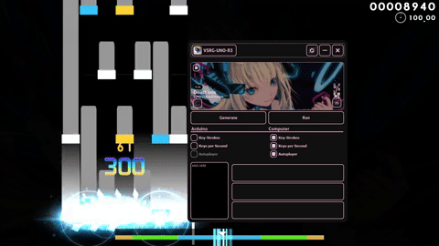
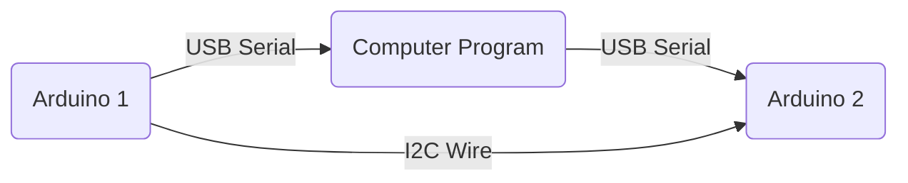

<a name="readme-top"></a>
<h1 align="center">
  <a href="https://github.com/typeRYOON/VSRG-UNO-R3/"></a>
</h1>

<h4 align="center">Arduino VSRG Auto Player w/ Stats Display!</h4>

<p align="center">
    <a href="https://github.com/typeRYOON/VSRG-UNO-R3/commits/master">
    
    <a href="https://github.com/typeRYOON/VSRG-UNO-R3/issues">
    
    <a href="https://github.com/typeRYOON/VSRG-UNO-R3/pulls">
    
    <a href="https://github.com/typeRYOON/VSRG-UNO-R3/blob/master/LICENSE.md">
    
</p>

<p align="center">
  <a href="#about-the-project">About</a> •
  <a href="#installation">Installation</a> •
  <a href="#prerequisites">Prerequisites</a> •
  <a href="#building-from-source">Building</a> •
  <a href="#hardware">Hardware</a> •
  <a href="docs">Documents</a> •
  <a href="#dependencies">Dependencies</a> •
  <a href="#license">License</a> •
  <a href="#contact">Contact</a>
</p>

<!-- ABOUT THE PROJECT -->
## About The Project
<table><tr><td>  

**VSRG-UNO-R3** is a _hack_ and _stats display_ for **osu!mania** that has an Arduino microcontroller extension that you can optionally build. You can customize the configuration you'd like to run
in the custom GUI that was built for this program.

The GUI lets you bind to specific serial ports for transmission to and from the optionally built Arduino microcontrollers. The auto playing hack allows for 4, 5, 6, and 7 key gameplay
to be automated.

There are displays that you can turn on, they show your keys per second and key strokes as you play. Each Arduino feature has a computer version, allowing you to use whichever one you'd like.
This program was created for CS362 at the University of Illinois Chicago.
<h1></h1><br>
<p align="center">
  <a href="https://github.com/typeRYOON/VSRG-UNO-R3/">
    
  </a>
</p>
<p align="right">
<sub>[ <a href="#readme-top">↑ back to top ↑</a> ]  </sub>
</p>

</table></tr></td>

<!-- Installation -->
## Installation
<table><tr><td>  

Go over to [`Releases`](https://github.com/typeRYOON/VSRG-UNO-R3/releases) and download `VSRG-UNO-R3.zip` or `VSRG-UNO-R3.7z`.  
Skip the `Building from source` section if you're using the Release binary.
&emsp;&emsp;&emsp;&emsp;&emsp;&emsp;&emsp;&emsp;&emsp;&emsp;&emsp;&emsp;&emsp;&emsp;&emsp;&emsp;&emsp;&emsp;&emsp;&emsp;&emsp;&emsp;&emsp;&emsp;&emsp;&emsp;&emsp;&emsp;&emsp;&emsp;&emsp;&emsp;&emsp;&emsp;
<h1></h1>

### Prerequisites  
* `Windows` : This project only works on Windows due to the usage of `Windows.h`.  
* `Arduino hardware` : Some hardware listed [below](#hardware) (only if you want to use Arduino features).

### Building from source

1. Clone the repo
   ```sh
   git clone https://github.com/typeRYOON/VSRG-UNO-R3.git
   cd computer/GUI
   ```
2. Open `CMakeLists.txt` in Qt Creator to open the project.
   ```
   - Please make sure you're using Qt 6.6.2+.
   - Install additional libraries Qt::WebSockets and Qt::SerialPort in the Qt Maintenance Tool.
   ```
3. Build the Release Build in Qt Creator.
4. In your base Qt folder run `windeployqt6.exe`  
   ```sh
   cd C:/Qt/6.6.2/mingw_64/bin
   windeployqt6 "%PATH_TO_BUILD_EXE_DIR%"
   ```
<p align="right">
  <sub>[ <a href="#readme-top">↑ back to top ↑</a> ]  </sub>
</p>
</table></tr></td>  

## Hardware
<table><tr><td>
<br>

> [!NOTE]
> This project allows you to use 0, 1, or both Arduino microcontrollers at once.  
> Build the below configurations depending on your materials and wanted Arduino features.      


<h1></h1>     

### Arduino 1: Autoplayer  
* `4x-7x` Photoresistors
* `4x-7x` 10K ohm resistors
* `4x-7x` LEDs
* `4x-7x` 220 ohm resistors
* `1x` Arduino Uno R3
* `1x` Breadboard
* `1x` Serial cable
* Supplements: wires (extensions, double sided), tape, styrofoam
&emsp;&emsp;&emsp;&emsp;&emsp;&emsp;&emsp;&emsp;&emsp;&emsp;&emsp;&emsp;&emsp;&emsp;&emsp;&emsp;&emsp;&emsp;&emsp;&emsp;&emsp;&emsp;&emsp;&emsp;&emsp;&emsp;&emsp;&emsp;&emsp;&emsp;&emsp;&emsp;&emsp;&emsp;
<h1></h1>

### Arduino 2: Key-strokes / Keys per second display
* `2x` 10K Ohm potentiometer  
* `1x` 16x2 LCD display
* `1x` Nokia 5110 LCD
* `4x` 10K ohm resistors
* `1x` 220 ohm resistor
* `1x` 330 ohm resistor
* `1x` 1K omh resistor

<p align="right">
  <sub>[ <a href="#readme-top">↑ back to top ↑</a> ]  </sub>
</p>
</table></tr></td>

<!-- USAGE EXAMPLES -->
## Usage

<table><tr><td>

<br>

> [!IMPORTANT]
> Make sure to set your 4, 5, 6, and 7 keys in game.  
> Please install the .ttf font [file](res/osu!/NotoSansJP-Regular.ttf).  
> Please make sure to have an osu! account, this program needs a user's osu!.config file to read from.&emsp;&emsp;&emsp;&emsp;&emsp;&emsp;&emsp;&emsp;&emsp;&emsp;&emsp;&emsp;&emsp;&emsp;&emsp;&nbsp;&nbsp;

> [!NOTE]
> Please use the given osu skin, especially for the Arduino autoplayer. ([here](res/osu!/VSRG-UNO-R3.osk))  
> [Here](res/osu!/Beatmaps.txt) are some test beatmaps.  

<h1></h1>

> - Have `osu!` open already. ([download](https://osu.ppy.sh/home/download))
> - Open `VSRG-UNO-R3.exe`.
> - If you're planning to use Arduino features open the settings page via the top button.
>   - In the port area there are two port entries, enter the COM port(s) that your Arduino are connected to.
>     - (e.g. `COM3`, `COM4`, check Arduino IDE)
>   - Click on the green refresh button, this will assign the ports.
>     - AP stands for Autoplayer (Arduino 1).
>     - KS/KPS stands for Key-strokes (Arduino 2).
> - Now click on the features you'd like to run for the current beatmap.
>   - AP will auto-play the current beatmap.
>   - KS will show the key strokes as an animation.
>   - KPS will show the keys per second.
> - Click on the Run button, this will put you into a ready state.
>   - If you press H, the selection will start running.
>   - If you press J or the terminate button, this will terminate the selection early.
>     - The current selection will terminate when you exit to the menu or enter the results screen.
> - The message box in the bottom left will show you the current state.
> - The generation history is to the right of the message box.
<p align="right">
  <sub>[ <a href="#readme-top">↑ back to top ↑</a> ]  </sub>
</p>
</table></tr></td>

<!-- DEPENDENCIES -->
## Dependencies

<table><tr><td>
<br>

> [!NOTE]
> You don't need to install anything.  
> The following software is used.
&emsp;&emsp;&emsp;&emsp;&emsp;&emsp;&emsp;&emsp;&emsp;&emsp;&emsp;&emsp;&emsp;&emsp;&emsp;&emsp;&emsp;&emsp;&emsp;&emsp;&emsp;&emsp;&emsp;&emsp;&emsp;&emsp;&emsp;&emsp;&emsp;&emsp;
&emsp;&emsp;&emsp;&emsp;&emsp;&emsp;&emsp;&emsp;&emsp;&emsp;&emsp;&emsp;&emsp;&emsp;&emsp;&nbsp;
<h1></h1>

- [`gosumemory`](https://github.com/l3lackShark/gosumemory)
- [`Qt6`](https://www.qt.io/product/qt6)  


<p align="right">
  <sub>[ <a href="#readme-top">↑ back to top ↑</a> ]  </sub>
</p>
</table></tr></td>

<!-- LICENSE -->
## License

<table><tr><td>

Distributed under the GNU General Public License v3.0. See [`LICENSE.md`](LICENSE.md) for more information.&emsp;&emsp;&emsp;&emsp;&emsp;&emsp;&emsp;&emsp;&emsp;&emsp;&emsp;&emsp;&emsp;&emsp;&emsp;&emsp;&emsp;&emsp;&emsp;&nbsp;&nbsp;&nbsp;&nbsp;&nbsp;
<p align="right">
  <sub>[ <a href="#readme-top">↑ back to top ↑</a> ]  </sub>
</p>
</table></tr></td>

<!-- CONTACT -->
## Contact

<table><tr><td>

If something needs my direct attention, please message me using the following connections.&emsp;&emsp;&emsp;&emsp;&emsp;&emsp;&emsp;&emsp;&emsp;&emsp;&emsp;&emsp;&emsp;&emsp;&emsp;&emsp;&emsp;&emsp;&emsp;&emsp;&nbsp;&nbsp;&nbsp;

<h1></h1>

* `Discord` [typeRYOON](https://discord.com/)
* `Email` typeRYOON@proton.me
<p align="right">
  <sub>[ <a href="#readme-top">↑ back to top ↑</a> ]  </sub>
</p>
</table></tr></td>
