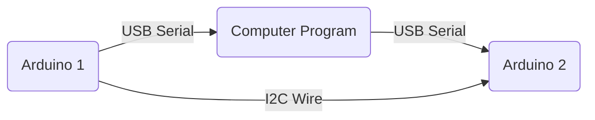

<a name="readme-top"></a>
<h1 align="center">
  <br>
  <a href="https://github.com/typeRYOON/VSRG-UNO-R3/"></a>
</h1>

<h4 align="center">Arduino VSRG Auto Player w/ Stats Display!</h4>

<p align="center">
    <a href="https://github.com/typeRYOON/VSRG-UNO-R3/commits/master">
    
    <a href="https://github.com/typeRYOON/VSRG-UNO-R3/issues">
    
    <a href="https://github.com/typeRYOON/VSRG-UNO-R3/pulls">
    
    <a href="https://github.com/typeRYOON/VSRG-UNO-R3/blob/master/LICENSE.md">
    
</p>

<p align="center">
  <a href="#installation">Installation</a> •
  <a href="#updating">Updating</a> •
  <a href="#features">Features</a> •
  <a href="#symbols">Symbols</a> •
  <a href="#binds">Binds</a> •
  <a href="#wiki">Wiki</a> •
  <a href="#contributing">Contributing</a> •
  <a href="#deprecated">Deprecated</a> •
  <a href="#credits">Credits</a> •
  <a href="#support">Support</a> •
  <a href="#license">License</a>
</p>


<!-- ABOUT THE PROJECT -->
## About The Project

<h1 align="center">
  <br>
  <a href="https://github.com/typeRYOON/VSRG-UNO-R3/">
    
  </a>
  
</h1>

Here's a blank template to get started:

<p align="right">(<a href="#readme-top">back to top</a>)</p>

### Built With

* [![Qt][Qt]][Qt-url]
* [![C++][C++]][C++-url]
* [![LaTex][LaTeX]][LaTeX-url]
* [![Arduino][Arduino]][Arduino-url]
* [![Windows][Windows]][Windows-url]  
* [![Markdown][Markdown]][Markdown-url]  

<p align="right">(<a href="#readme-top">back to top</a>)</p>

<!-- GETTING STARTED -->
## Getting Started

This is an example of how you may give instructions on setting up your project locally.
To get a local copy up and running follow these steps.

### Prerequisites

* `Windows` : This project only works on Windows due to the usage of `Windows.h`.  
* `Arduino hardware` : Some hardware listed [below](#arduino-hardware) (only if you want to use Arduino features).
* ``

## Installation
Go over to Releases and download `VSRG-UNO-R3.zip` or `VSRG-UNO-R3.7z`.  
Skip the `Building from source` section if you're using the Release binary.

### Building from source

1. Clone the repo
   ```sh
   git clone https://github.com/typeRYOON/VSRG-UNO-R3.git
   cd computer/GUI
   ```
2. Open `CMakeLists.txt` in Qt Creator to open the project.
   ```
   - Please make sure you're using Qt 6.6.2+.
   - Install additional Qt libraries Qt::WebSockets and Qt::SerialPort in the Qt Maintenance Tool.
   ```
3. Build the Debug Build in Qt Creator.
4. In your base Qt folder run `windeployqt6.exe`  
   ```sh
   cd C:/Qt/6.6.2/mingw_64/bin
   windeployqt6 "%PATH_TO_BUILD_EXE_DIR%"
   ```
<p align="right">(<a href="#readme-top">back to top</a>)</p>  

## Arduino Hardware  
> The projects allows you to use 0, 1, or both Arduino microcontrollers at once.  
> Build the below configurations depending on your materials and wanted Arduino features.  

### Arduino 1: Autoplayer  
* `4x` Photoresistor
* `4x` 10K ohm resistors
* `4x` LEDs
* `4x` 220 ohm resistors
* `1x` Arduino Uno R3
* `1x` Breadboard
* `1x` Serial cable
* Supplements: wires (extensions, double sided), tape, styrofoam

### Arduino 2: Key-strokes / Keys per second display
* `2x` 10K Ohm potentiometer  
* `1x` 16x2 LCD display
* `1x` Nokia 5110 LCD
* `4x` 10K ohm resistors
* `1x` 220 ohm resistor
* `1x` 330 ohm resistor
* `1x` 1K omh resistor
* `WIP`

<p align="right">(<a href="#readme-top">back to top</a>)</p>

<!-- USAGE EXAMPLES -->
## Usage
WIP

_For more examples, please refer to the [Documentation](https://example.com)_

<p align="right">(<a href="#readme-top">back to top</a>)</p>

<!-- LICENSE -->
## License

Distributed under the MIT License. See `LICENSE.txt` for more information.

<p align="right">(<a href="#readme-top">back to top</a>)</p>


<!-- CONTACT -->
## Contact

Your Name - [@twitter_handle](https://twitter.com/twitter_handle) - typeRYOON@pm.me

Project Link: [https://github.com/typeRYOON/VSRG-UNO-R3](https://github.com/typeRYOON/VSRG-UNO-R3)

<p align="right">(<a href="#readme-top">back to top</a>)</p>


<!-- ACKNOWLEDGMENTS -->
## Acknowledgments

* []()
* []()
* []()

<p align="right">(<a href="#readme-top">back to top</a>)</p>




$$
\Gamma(z) = \int_0^\infty t^{z-1}e^{-t}dt\,.
$$


<!-- MARKDOWN LINKS & IMAGES -->
<!-- https://www.markdownguide.org/basic-syntax/#reference-style-links -->
[product-screenshot]: images/screenshot.png  
[Qt]: https://img.shields.io/badge/Qt-%23217346.svg?style=for-the-badge&logo=Qt&logoColor=white  
[Qt-url]: https://www.qt.io/  
[C++]: https://img.shields.io/badge/c++-%2300599C.svg?style=for-the-badge&logo=c%2B%2B&logoColor=white  
[C++-url]: https://isocpp.org/  
[LaTeX]: https://img.shields.io/badge/latex-%23008080.svg?style=for-the-badge&logo=latex&logoColor=white  
[LaTeX-url]: https://www.latex-project.org/  
[Markdown]: https://img.shields.io/badge/markdown-%23000000.svg?style=for-the-badge&logo=markdown&logoColor=white  
[Markdown-url]: https://www.markdownguide.org/  
[Windows]: https://img.shields.io/badge/Windows-0078D6?style=for-the-badge&logo=windows&logoColor=white  
[Windows-url]: https://www.microsoft.com/en-us/windows
[Arduino]: https://img.shields.io/badge/-Arduino-00979D?style=for-the-badge&logo=Arduino&logoColor=white  
[Arduino-url]: https://www.arduino.cc/  
